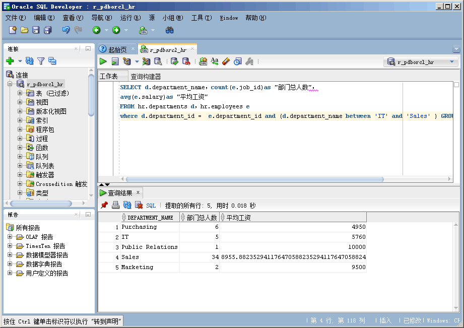

# 查询1
## 代码
``` sql
SELECT d.department_name，count(e.job_id)as "部门总人数"，
avg(e.salary)as "平均工资"
from hr.departments d，hr.employees e
where d.department_id = e.department_id
and d.department_name in ('IT'，'Sales')
GROUP BY department_name;
```
## 分析

## 运行截图


# 查询2
## 代码
``` sql
SELECT d.department_name，count(e.job_id)as "部门总人数"，
avg(e.salary)as "平均工资"
FROM hr.departments d，hr.employees e
WHERE d.department_id = e.department_id
GROUP BY department_name
HAVING d.department_name in ('IT'，'Sales');
```
## 分析

## 运行截图


# 我的查询
## 代码
``` sql
SELECT d.department_name，count(e.job_id)as "部门总人数"，
avg(e.salary)as "平均工资"
FROM hr.departments d，hr.employees e
where d.department_id =  e.department_id and d.department_name between 'IT' and 'Sales'  GROUP BY d.department_name
```
## 运行截图



