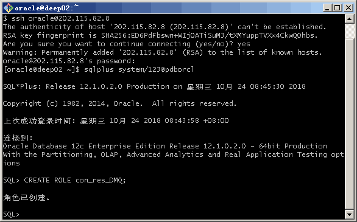
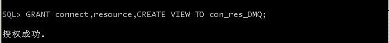
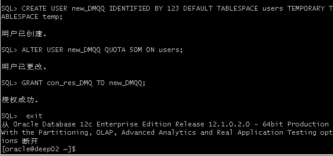
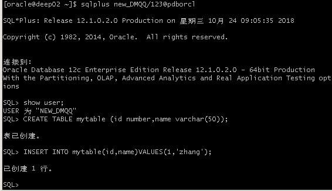
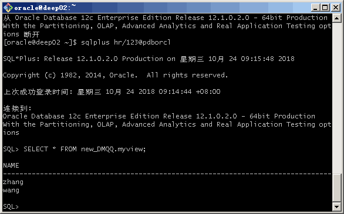
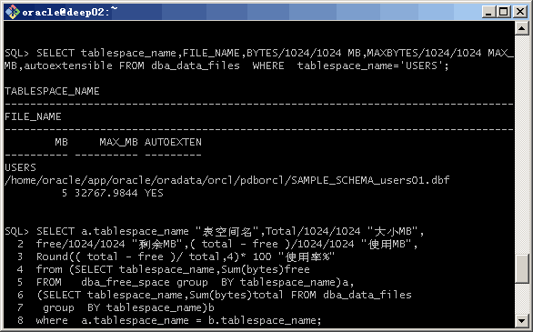
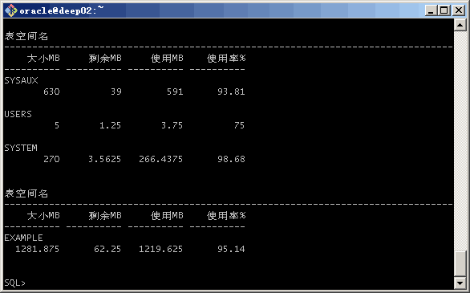

# 实验2：用户管理 - 掌握管理角色、权根、用户的能力，并在用户之间共享对象。
## 第一步：以system登录到pdborcl，创建角色con_res_DMQ和用户new_DMQQ，并授权和分配空间
## 代码：
``` 
•	$ sqlplus system/123@pdborcl
•	SQL> CREATE ROLE con_res_DMQ;
•	Role created.
•	SQL> GRANT connect,resource,CREATE VIEW TO con_res_view;
•	Grant succeeded.
•	SQL> CREATE USER new_DMQQ IDENTIFIED BY 123 DEFAULT TABLESPACE users TEMPORARY TABLESPACE temp;
•	User created.
•	SQL> ALTER USER new_DMQQ QUOTA 50M ON users;
•	User altered.
•	SQL> GRANT con_res_DMQ TO new_DMQQ;
•	Grant succeeded.
•	SQL> exit
```
## 截图:



## 第二步：新用户new_DMQQ连接到pdborcl，创建表mytable和视图myview，插入数据，最后将myview的SELECT对象权限授予hr用户。
## 代码：
``` 
•$ sqlplus new_DMQQ/123@pdborcl
•SQL> show user;
•USER is "NEW_DMQQ"
•SQL> CREATE TABLE mytable (id number,name varchar(50));
•Table created.
•SQL> INSERT INTO mytable(id,name)VALUES(1,'zhang');
•1 row created.
•SQL> INSERT INTO mytable(id,name)VALUES (2,'wang');
•1 row created.
•SQL> CREATE VIEW myview AS SELECT name FROM mytable;
•View created.
•SQL> SELECT * FROM myview;
```
## 截图:



## 第三步：用户hr连接到pdborcl，查询new_user授予它的视图myview
## 代码：
``` 
•$ sqlplus hr/123@pdborcl
•SQL> SELECT * FROM new_user.myview;
•SQL> exit
```
## 截图:

## 查看数据库的使用情况
## 以下样例查看表空间的数据库文件，以及每个文件的磁盘占用情况。
## 代码：
``` 
•$ sqlplus system/123@pdborcl
•SQL>SELECT tablespace_name,FILE_NAME,BYTES/1024/1024 MB,MAXBYTES/1024/1024 MAX_MB,autoextensible FROM dba_data_files  WHERE  •tablespace_name='USERS';
•SQL>SELECT a.tablespace_name "表空间名",Total/1024/1024 "大小MB",
•free/1024/1024 "剩余MB",( total - free )/1024/1024 "使用MB",
•Round(( total - free )/ total,4)* 100 "使用率%"
•from (SELECT tablespace_name,Sum(bytes)free
•FROM   dba_free_space group  BY tablespace_name)a,
•(SELECT tablespace_name,Sum(bytes)total FROM dba_data_files
• group  BY tablespace_name)b
•where  a.tablespace_name = b.tablespace_name;
```
## 截图:





