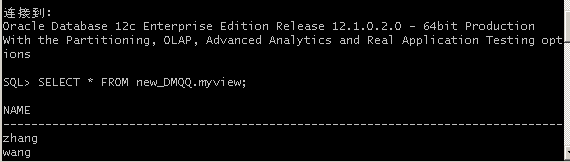

# 实验2：用户管理 - 掌握管理角色、权根、用户的能力，并在用户之间共享对象。
## 第一步：以system登录到pdborcl，创建角色con_res_DMQ和用户new_DMQQ，并授权和分配空间
## 代码：
``` 
•	$ sqlplus system/123@pdborcl
•	SQL> CREATE ROLE con_res_DMQ;
•	Role created.
•	SQL> GRANT connect,resource,CREATE VIEW TO con_res_view;
•	Grant succeeded.
•	SQL> CREATE USER new_DMQQ IDENTIFIED BY 123 DEFAULT TABLESPACE users TEMPORARY TABLESPACE temp;
•	User created.
•	SQL> ALTER USER new_DMQQ QUOTA 50M ON users;
•	User altered.
•	SQL> GRANT con_res_DMQ TO new_DMQQ;
•	Grant succeeded.
•	SQL> exit
```
## 截图:


## 第二步：新用户new_user连接到pdborcl，创建表mytable和视图myview，插入数据，最后将myview的SELECT对象权限授予hr用户。
## 代码：
``` 
•	$ sqlplus new_user/123@pdborcl
•SQL> show user;
•USER is "NEW_USER"
•SQL> CREATE TABLE mytable (id number,name varchar(50));
•Table created.
•SQL> INSERT INTO mytable(id,name)VALUES(1,'zhang');
•1 row created.
•SQL> INSERT INTO mytable(id,name)VALUES (2,'wang');
•1 row created.
•SQL> CREATE VIEW myview AS SELECT name FROM mytable;
•View created.
•SQL> SELECT * FROM myview;
```
## 截图:


## 第三步：用户hr连接到pdborcl，查询new_user授予它的视图myview
## 代码：
``` 
•$ sqlplus hr/123@pdborcl
•SQL> SELECT * FROM new_user.myview;
•SQL> exit
```
## 截图:


