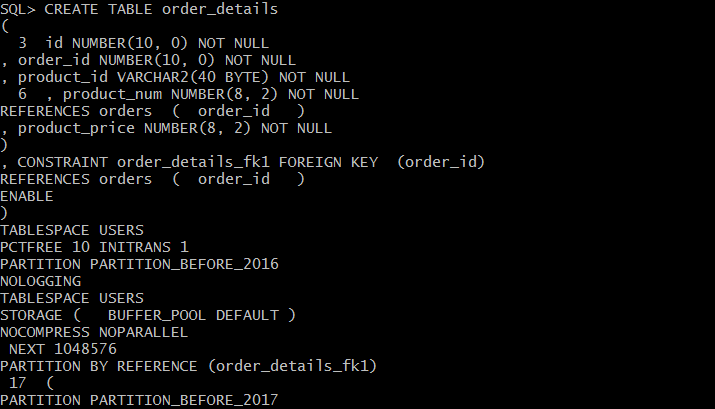
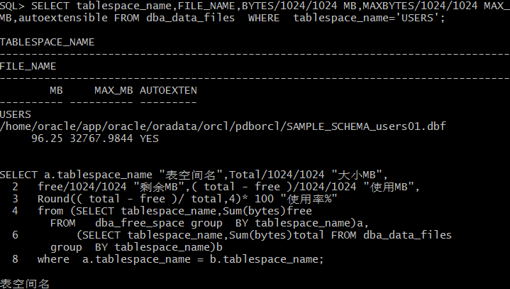
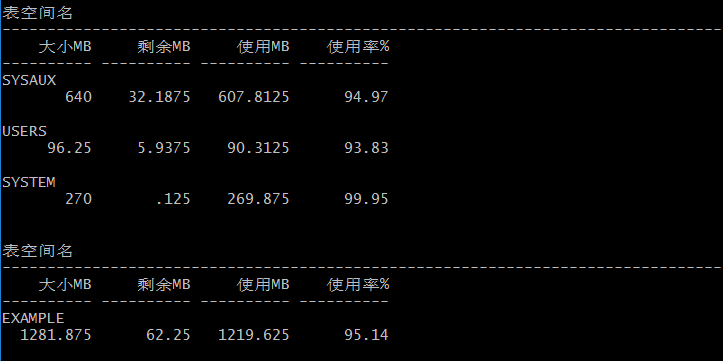
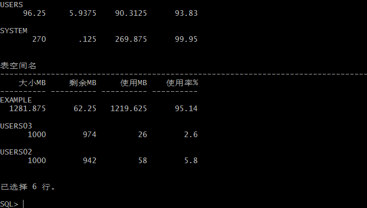

# 实验3：创建分区表
## 步骤
## （1）创建orders表
## 代码：
```
CREATE TABLE "NEW_DMQQ"."ORDERS" 
   (	"ORDER_ID" NUMBER(10,0) NOT NULL ENABLE, 
	"CUSTOMER_NAME" VARCHAR2(40 BYTE) NOT NULL ENABLE, 
	"CUSTOMER_TEL" VARCHAR2(40 BYTE) NOT NULL ENABLE, 
	"ORDER_DATE" DATE NOT NULL ENABLE, 
	"EMPLOYEE_ID" NUMBER(6,0) NOT NULL ENABLE, 
	"DISCOUNT" NUMBER(8,2) DEFAULT 0, 
	"TRADE_RECEIVABLE" NUMBER(8,2) DEFAULT 0, 
	 CONSTRAINT "ORDERS_PK" PRIMARY KEY ("ORDER_ID")
  USING INDEX PCTFREE 10 INITRANS 2 MAXTRANS 255 COMPUTE STATISTICS 
  TABLESPACE "USERS"  ENABLE
   ) PCTFREE 10 PCTUSED 40 INITRANS 1 MAXTRANS 255 
 NOCOMPRESS 
  STORAGE(
  BUFFER_POOL DEFAULT FLASH_CACHE DEFAULT CELL_FLASH_CACHE DEFAULT)
  TABLESPACE "USERS" 
  PARTITION BY RANGE ("ORDER_DATE") 
 (PARTITION "PARTITION_BEFORE_2016"  VALUES LESS THAN (TO_DATE(' 2016-01-01 00:00:00', 'SYYYY-MM-DD HH24:MI:SS', 'NLS_CALENDAR=GREGORIAN'))   NO INMEMORY SEGMENT CREATION DEFERRED 
  PCTFREE 10 PCTUSED 40 INITRANS 1 MAXTRANS 255 
 NOCOMPRESS NOLOGGING 
  STORAGE( INITIAL 8388608 NEXT 1048576 MINEXTENTS 1 MAXEXTENTS 2147483645
  BUFFER_POOL DEFAULT FLASH_CACHE DEFAULT CELL_FLASH_CACHE DEFAULT)
  TABLESPACE "USERS" , 
 PARTITION "PARTITION_BEFORE_2017"  VALUES LESS THAN (TO_DATE(' 2017-01-01 00:00:00', 'SYYYY-MM-DD HH24:MI:SS', 'NLS_CALENDAR=GREGORIAN')) SEGMENT CREATION DEFERRED 
  PCTFREE 10 PCTUSED 40 INITRANS 1 MAXTRANS 255 
 NOCOMPRESS NOLOGGING 
  STORAGE(
  BUFFER_POOL DEFAULT FLASH_CACHE DEFAULT CELL_FLASH_CACHE DEFAULT)
  TABLESPACE "USERS02" ) ;
```
## 截图：


## （2）创建order_details表
## 代码：
```
CREATE TABLE order_details 
(
id NUMBER(10, 0) NOT NULL 
, order_id NUMBER(10, 0) NOT NULL
, product_id VARCHAR2(40 BYTE) NOT NULL 
, product_num NUMBER(8, 2) NOT NULL 
, product_price NUMBER(8, 2) NOT NULL 
, CONSTRAINT order_details_fk1 FOREIGN KEY  (order_id)
REFERENCES orders  (  order_id   )
ENABLE 
) 
TABLESPACE USERS 
PCTFREE 10 INITRANS 1 
STORAGE (   BUFFER_POOL DEFAULT ) 
NOCOMPRESS NOPARALLEL
PARTITION BY REFERENCE (order_details_fk1)
(
PARTITION PARTITION_BEFORE_2016 
NOLOGGING 
TABLESPACE USERS
PCTFREE 10 
INITRANS 1 
STORAGE 
( 
 INITIAL 8388608 
 NEXT 1048576 
 MINEXTENTS 1 
 MAXEXTENTS UNLIMITED 
 BUFFER_POOL DEFAULT 
) 
NOCOMPRESS NO INMEMORY, 
PARTITION PARTITION_BEFORE_2017 
NOLOGGING 
TABLESPACE USERS02
);

```
## 截图：


## （3）以system登录，查看表空间的使用情况
## 代码：
```
SQL>SELECT tablespace_name,FILE_NAME,BYTES/1024/1024 MB,MAXBYTES/1024/1024 MAX_MB,autoextensible FROM dba_data_files  WHERE  tablespace_name='USERS';

SQL>SELECT a.tablespace_name "表空间名",Total/1024/1024 "大小MB",
 free/1024/1024 "剩余MB",( total - free )/1024/1024 "使用MB",
 Round(( total - free )/ total,4)* 100 "使用率%"
 from (SELECT tablespace_name,Sum(bytes)free
        FROM   dba_free_space group  BY tablespace_name)a,
       (SELECT tablespace_name,Sum(bytes)total FROM dba_data_files
        group  BY tablespace_name)b
 where  a.tablespace_name = b.tablespace_name;
```

## 截图：



