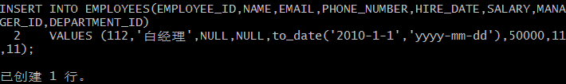

# 实验4：对象管理
## 一、表的创建
## （1）CREATE TABLE DEPARTMENTS


## （2）CREATE TABLE EMPLOYEES


## 创建索引

## 创建外键


## CREATE TABLE PRODUCTS


## CREATE GLOBAL TEMPORARY TABLE "ORDER_ID_TEMP"

## CREATE TABLE ORDERS


## 创建索引

## 创建主键和外键
```
ALTER TABLE ORDERS
ADD CONSTRAINT ORDERS_PK PRIMARY KEY
(
  ORDER_ID
)
USING INDEX ORDERS_PK
ENABLE;
```
```
ALTER TABLE ORDERS
ADD CONSTRAINT ORDERS_FK1 FOREIGN KEY
(
  EMPLOYEE_ID
)
REFERENCES EMPLOYEES
(
  EMPLOYEE_ID
)
ENABLE;
```


## CREATE TABLE ORDER_DETAILS


## 二、创建触发器


## 三、录入数据
## 插入DEPARTMENTS，EMPLOYEES数据





## 四、查询数据
## 递归查询某个员工及其所有下属，子下属员工


## 查询一个分区中的数据


