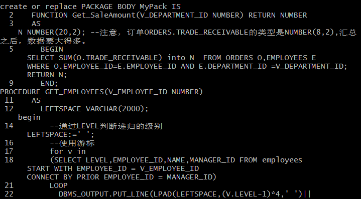
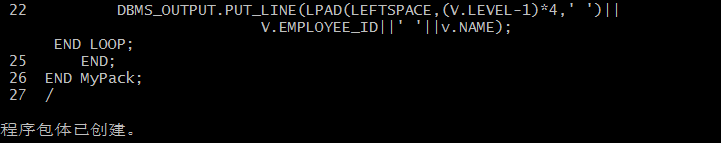
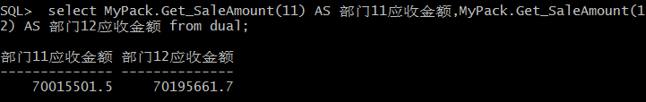
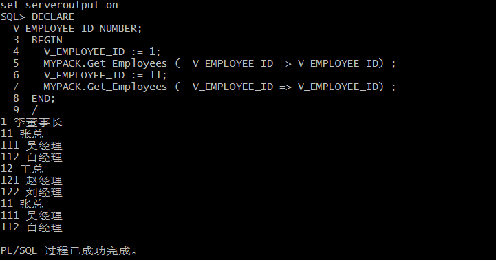

# 实验5：PL/SQL编程
## 实验内容
## （1）创建一个包(Package)，包名是MyPack

## （2）MyPack中创建一个函数SaleAmount ，查询部门表，统计每个部门的销售总金额，每个部门的销售额是由该部门的员工(ORDERS.EMPLOYEE_ID)完成的销售额之和。函数SaleAmount要求输入的参数是部门号，输出部门的销售金额。

## （3）在MyPack中创建一个过程，在过程中使用游标，递归查询某个员工及其所有下属，子下属员工。过程的输入参数是员工号，输出员工的ID,姓名，销售总金额。信息用dbms_output包中的put或者put_line函数。输出的员工信息用左添加空格的多少表示员工的层次（LEVEL）。比如下面显示5个员工的信息：

## （4）由于订单只是按日期分区的，上述统计是全表搜索，因此统计速度会比较慢，如何提高统计的速度呢？
 ①对表和索引进行分区，使用复合分区，表进行范围分区后，然后在每个分区内再使用散列分区的一种分区方法，如将记录按时间分区，然后每个分区中的数据分三个子分区，将数据散列地存储在三个指定的表空间中。
 ②尽量使用索引
